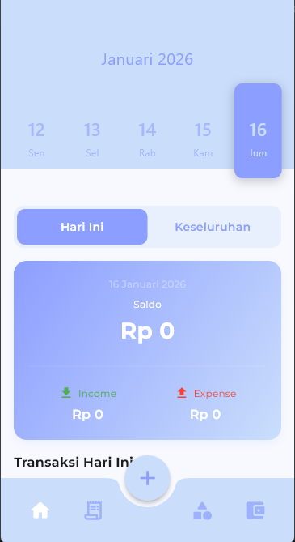

# 💰 Finance App (Flutter)

A simple personal finance mobile app built with **Flutter**.
This project is created for learning and exploring Flutter, local database, and UI implementation.

## ✨ Features
- Track income & expenses
- Transaction categories
- Monthly & yearly filtering
- Local data storage
- Wallet management
- Edit & delete transactions
- Daily and monthly reports
- Custom calendar and month picker

## 🛠 Tech Stack
- Flutter (Dart)
- SQLite / Drift
- Provider (State Management)
- Material Design

## 🚀 Getting Started
```bash
git clone https://github.com/farhanzsani/Finance-App-FLutter.git
cd Finance-App-FLutter
flutter pub get
flutter run
```

## 📱 Screenshots



## 📂 Project Structure
- `lib/Models/` : Database models (category, transaction, wallet, etc)
- `lib/pages/`  : App pages (home, transaction, report, wallet, etc)
- `lib/main.dart`: App entry point

## 📝 Notes
- This app is for learning purposes and not for production use.
- Contributions are welcome!

## 📄 License
MIT
